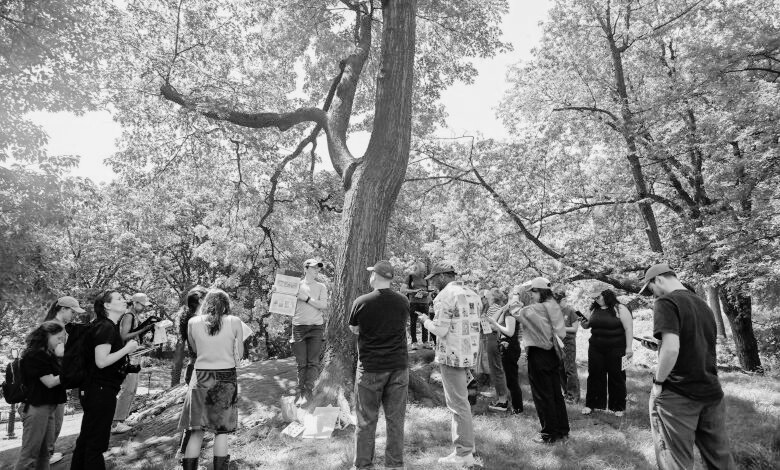
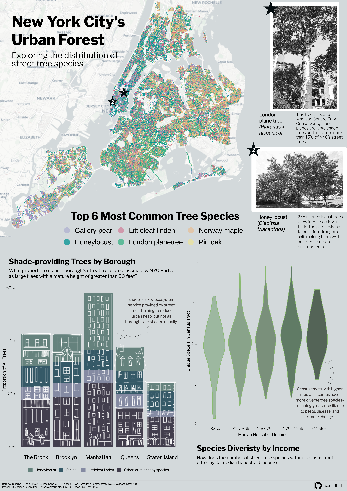

## New York City's Urban Forest

#### Exploring the distribution of tree species in NYC

When deciding upon an infographic theme, I was inspired by landscape architecture and urban planning illustrations that contained both sharp urban angles and organic drawings of plants. I thought a lot about how I could combine an urban environment with plants and what specific interests of my own I could bring, and ended up settling on looking at street trees in New York City. This perfectly tied together my plant science background with one of my favorite cities, and I had a lot of fun working with data that allowed me to be creative.

The 2015 tree census was the third decadal street tree census and largest citizen science initiative in NYC Park's history, bringing more than 2,200 volunteers together. Tree data collected included tree species, diameter, and perception of health. The results of the census showed that there were 666,134 trees planted along NYC's streets!

```{r}
#| code-fold: TRUE
#| eval: true
#| echo: false
#| fig-align: "center"
#| out-width: "80%"
#| fig-alt: "Image of tree census volunteers circled around a large tree"

```

Trees are greatly valued by everyone, as evident by the sheer number of people who supported the collection of the tree census data. Trees also provide a number of ecosystem services, including absorbing carbon dioxide and pollutants from the atmosphere, protecting biodiversity by providing habitat, cooling cities through shade and evapotranspiration, and overall increasing our mental and physical health when we are near them.

However, these wide-ranging benefits of trees are not necessarily felt equally, whether that be spatially throughout the city or by various societal groups. Using U.S. Census Bureau American Community Survey data collected in 2015 and the same year's tree census data, I created an infographic to address the following questions:

-   How are New York City's street tree species distributed?

    -   Are there any spatial patterns in where the most common species are?

    -   How are large shade trees distributed throughout the boroughs?

    -   Does street tree species diversity vary by income group?

You can explore the [tree census data here](https://data.cityofnewyork.us/Environment/2015-Street-Tree-Census-Tree-Data/uvpi-gqnh/about_data).

```{r}
#| code-fold: TRUE
#| eval: true
#| echo: false
#| fig-align: "center"
#| out-width: "100%"
#| fig-alt: "Full infographic exploring street tree species distributions throughout New York City, including a map, stacked bar chart, and violin plot."

```

Overall, my I found that there is a lot of variation in where tree species are within New York City, no matter how you subset the data. Looking at tree census data in this way can help organizations like NYC Parks determine what boroughs and societal groups might be lacking different tree species and help guide planting initiatives, with the goal of giving all people in the city access to the benefits of trees. 

My infographic is made up of three plots which were created using the {ggplot2} package in R and Affinity Designer. Let's explore some key pieces and the behind-the-scenes of my design choices!

## Overall design 

For my **font**, I selected **Libre Franklin**. This font is extremely similar to the heading font used in New York Times visualizations (NYT Franklin), but accessible through Google Fonts for use in R and Affinity. I wanted to tie in the connotation and familiarity of looking at information related to New York by using this font. I kept this font consistently throughout my infographic, but selected variations (extra bold, bold, regular, and light) to create visual hierarchy. 

For my **color palette**, I initially planned to use a variety of green tones for all of my plots to maintain a tree theme. However, I realized that using many shades of the same color for the plot types that I was building, especially a plot with many overlapping points, using a **variety of colors** would be more colorblind-friendly and accessible. 

## Plots
#### Species location map

The magnitude of points contained within the tree census data was so large that it took a lot of time to think about how best to subset the data to convey a message. For this plot, I leaned in to the amount of observations and plotted all of the points for the 6 most common street tree species, for viewers of my infographic to get a sense of just how impressive this volunteer-centered data collection was. 

```{r}
#| code-fold: TRUE
#| eval: true
#| echo: false
#| fig-align: "center"
#| out-width: "60%"
#| fig-alt: "Spatial map of tree species locations."
knitr::include_graphics(here::here("blogimages", "nyc_species_map.png"))
```

To include this plot in my infographic, I knew I had to make a lot of adjustments to incorporate it well. Adjusting the background of my entire infographic in Affinity to match the ocean color of the basemap helped significantly to tie in this plot. I also adjusted my title to be centered over the legend, and utilized the blank map space to place my main infographic title. I wanted the main title to be the focus. Lastly, I wanted to break up all of the points and bring in some context so that it registers that each point is a full tree! I accomplished this by pinpointing the locations of a London plane tree and some Honey locusts, two central tree species thoughout my infographic. Writing a little tidbit about them allows the readers to dive into what these species are and how they thrive in the harsh urban environment of New York City. 

```{r}
#| code-fold: TRUE
#| eval: true
#| echo: false
#| fig-align: "center"
#| out-width: "80%"
#| fig-alt: "Spatial map of tree species locations."
knitr::include_graphics(here::here("blogimages", "info_map.png"))

```

#### Stacked bar chart

For this plot, I wanted to add a design element related to the more urban side of this topic and give the infographic a sense of place. I used Goodnotes to sketch the buildings on top of a screenshot of the stacked bar chart, exported the image into GIMP, another graphic design platform, to make the image background transparent. Finally, I imported it into Affinity and aligned it over my bar chart. 

This was definitely a complex process but an incredibly useful method to know if I want to incorporate more drawings into my data visualizations in the future!


```{r}
#| code-fold: TRUE
#| eval: true
#| echo: false
#| fig-align: "center"
#| out-width: "70%"
#| fig-alt: "Drawing of five skyscrapers that resemble a bar chart."
knitr::include_graphics(here::here("blogimages", "drawing.jpg"))
```

Here is the drawing placed over the bar chart:

```{r}
#| code-fold: TRUE
#| eval: true
#| echo: false
#| fig-align: "center"
#| out-width: "70%"
#| fig-alt: "Bar chart of proportion of shade species by borough."
knitr::include_graphics(here::here("blogimages", "barchart.png"))
```

My bar chart classifies large trees with a mature height of greater than 50 feet based upon [New York City Parks' Approved Species List for planting](https://www.nycgovparks.org/trees/street-tree-planting/species-list#:~:text=Table_title:%20Large%20Trees:%20Mature%20Height%20Greater%20Than,:%20Pin%20Oak%20%7C%20Form:%20Rounded%20%7C). I also added an annotation to emphasize the benefits of shade in urban environments and a key finding of the distribution of these trees across boroughs. 

#### Violin plot

This plot is where I tied in my socioeconomic data from the U.S. Census Bureau, which you can use in your own code by [requesting an API key](https://api.census.gov/data/key_signup.html) and accessing it using the {tidycensus} package in R. 

Each tree observation point was associated with a census tract, so I was able to join this data relatively easily with the census tract-level data and focus on the median household income variable. In terms of graphic form, I wanted this plot to look like leaves and colored them in an increasingly dark shade to allow readers to understand the pattern without reading each piece of the plot. I also added an annotation with my main finding, that higher income bins had more species diversity and why this is important for ecosystem stability. 

```{r}
#| code-fold: TRUE
#| eval: true
#| echo: false
#| fig-align: "center"
#| out-width: "70%"
#| fig-alt: "Violin plot of species diversity by income bin."
knitr::include_graphics(here::here("blogimages", "incomeviolin.png"))
```

If you would like to explore the code used to make these plots, see below!

## Code
```{r}
#| code-fold: TRUE
#| eval: FALSE
#| echo: TRUE

#### Load libraries
library(tidyverse)
library(here)
library(janitor)
library(sf)
library(showtext)
library(tidycensus)
library(readr)
library(ggspatial)

##~~~~~~~~~~~~~~~~~~~~~~~~~~~~~~~~~~~~~~~~~~~~~~~~~~~~~~~~~~~~~~~~~~~~~~~~~~~~~~
##                         Define Graphic Aesthetics                        ----
##~~~~~~~~~~~~~~~~~~~~~~~~~~~~~~~~~~~~~~~~~~~~~~~~~~~~~~~~~~~~~~~~~~~~~~~~~~~~~~

# Add font
font_add_google(name = "Libre Franklin", family = "franklin") # New York Times headers
showtext_auto()

# Create color palette 
 tree_palette <- c("London planetree" = "#39B185FF", "Honeylocust" = "#009392FF", "Callery pear" = "#9D9DCC", "Pin oak" = "#E9E29CFF", "Norway maple" = "#EEB479FF", "Littleleaf linden" = "#CF597EFF", "Other large canopy species" = "#B1C7B3FF")
 
##~~~~~~~~~~~~~~~~~~~~~~~~~~~~~~~~~~~~~~~~~~~~~~~~~~~~~~~~~~~~~~~~~~~~~~~~~~~~~~
##                         Import and wrangle data                         ----
##~~~~~~~~~~~~~~~~~~~~~~~~~~~~~~~~~~~~~~~~~~~~~~~~~~~~~~~~~~~~~~~~~~~~~~~~~~~~~~
 
# Import 2015 ACS data- you will need a census key!
acs_vars <- tidycensus::load_variables(year = 2015,
                                       dataset = "acs5")
# Import census tract income data
nyc_income <- get_acs(
  geography = "tract",
  variables = "B19013_001",
  state = "NY",
  county = c("061", "047", "081", "005", "085"),
  year = 2015,
  survey = "acs5",
  geometry = TRUE
) %>% 
  clean_names() %>% 
  mutate(
    census_tract = str_extract(name, "(?<=Census Tract )[\\d.]+"),
    borough = case_when(
      str_detect(name, "New York County") ~ "Manhattan",
      str_detect(name, "Kings County")    ~ "Brooklyn",
      str_detect(name, "Queens County")   ~ "Queens",
      str_detect(name, "Bronx County")    ~ "Bronx",
      str_detect(name, "Richmond County") ~ "Staten Island"
    )
  )

# Write to csv 
readr::write_csv(nyc_income, here::here("data", "nyc_income.csv"))

# Read in Tree Census data
trees <- read_csv(here("data", "2015_Street_Tree_Census_Data.csv")) %>% 
  clean_names() %>% 
  # Filter to living trees
  filter(status == "Alive") %>% 
  # Rename common species names for plotting
  mutate(spc_common = str_to_sentence(spc_common))

# Join Tree Census and ACS data
trees_census <- trees %>% 
  mutate(census_tract = as.character(census_tract)) %>% 
  left_join(nyc_income, by = c("census_tract" = "census_tract"))

##~~~~~~~~~~~~~~~~~~~~~~~~~~~~~~~~~~~~~~~~~~~~~~~~~~~~~~~~~~~~~~~~~~~~~~~~~~~~~~
##                     Visualization 1: Full NYC Map                        ----
##~~~~~~~~~~~~~~~~~~~~~~~~~~~~~~~~~~~~~~~~~~~~~~~~~~~~~~~~~~~~~~~~~~~~~~~~~~~~~~

# Find top tree species
top_trees <- trees %>% 
  count(spc_common, sort = TRUE) %>% 
  slice_head(n = 6)

# Filter data by these trees
trees_top <- trees %>% 
  filter(spc_common %in% c("London planetree", "Honeylocust", "Callery pear", "Pin oak", "Norway maple", "Littleleaf linden")) 

# Create top trees in NYC plot
p1 <-  ggplot(trees_top) +
  # Add basemap
  annotation_map_tile(type = "cartolight", zoom = 11) +
  geom_point(
    aes(longitude, latitude, color = spc_common),
    shape = 16,
    size = 0.2,
    alpha = 0.5
  ) +
  coord_sf(crs = 4326) +
  labs(title = "Where are NYC's trees?",
       subtitle = "Top 6 most common tree species in New York City",
       caption = "Data Sources: NYC Open Data, US Census Bureau TIGER Shapefiles (2015)") +
  scale_color_manual(values = tree_palette) +
  guides(color = guide_legend(override.aes = list(size = 6))) +
  theme_void(base_size = 20) +
  # Add custom theme elements
  theme(
        panel.spacing = unit(1.3, "lines"),
        strip.clip = "off",
        strip.text = element_text(family = "franklin"),
        plot.subtitle = element_text(family = "franklin", margin = margin(b = 12)),
        plot.caption = element_text(family = "franklin", size = rel(0.5), margin = margin(t = 5)),
        plot.title = element_text(family = "franklin", face = "bold", size = rel(1.7), margin = margin(b = 8)),
        plot.margin = margin(t = 4, r = 1, b = 10, l = 1),
        # move legend below plot ----
       legend.position = "bottom",
       legend.direction = "horizontal",
       legend.title = element_blank(),
       legend.key.width = unit(0.4, "cm"),
       legend.key.height = unit(0.25, "cm"),)

# Save figure as PDF
ggsave(here("figures", "nyc_species_map.pdf"), width = 8, height = 10, dpi = 150, bg = "white")

##~~~~~~~~~~~~~~~~~~~~~~~~~~~~~~~~~~~~~~~~~~~~~~~~~~~~~~~~~~~~~~~~~~~~~~~~~~~~~~
##                     Visualization 2: Stacked bar chart                   ----
##~~~~~~~~~~~~~~~~~~~~~~~~~~~~~~~~~~~~~~~~~~~~~~~~~~~~~~~~~~~~~~~~~~~~~~~~~~~~~~

# Create list of large trees from NYC Parks
large_trees <- c(
  "Ginkgo", "Sweetgum", "Dawn redwood", "Baldcypress",
  "Littleleaf linden", "Coffeetree", "Honeylocust",
  "Northern red oak", "Swamp white oak", "Shingle oak",
  "Pin oak", "Willow oak", "American linden",
  "Crimean linden", "Silver linden", "Japanese zelkova"
)

# Wrangle data for plot
shade_plot <- trees_census %>%
  # Remove trees with no income estimate
  filter(!is.na(estimate)) %>%
  # Categorize large trees in top trees, large trees not in top trees, and trees not considered large
  mutate(species_grp = case_when(
    spc_common %in% large_trees & spc_common %in% c("London planetree", "Honeylocust", "Callery pear",
                                                      "Pin oak", "Norway maple", "Littleleaf linden") ~ spc_common,
    spc_common %in% large_trees ~ "Other large canopy species",
    TRUE ~ "Other"
  )) %>%
  # Reorder groups
  mutate(species_grp = fct_relevel(species_grp,
    "Honeylocust", "Pin oak", "Littleleaf linden", "Other large canopy")) %>% 
  # Create proportions 
  group_by(borough.x, species_grp) %>%
  summarize(n = n()) %>%
  group_by(borough.x) %>%
  mutate(prop = n / sum(n)) %>%
  # Remove trees not considered large 
  filter(species_grp != "Other")

# Create stacked bar chart
 p2 <- ggplot(shade_plot, aes(x = prop, y = borough.x, fill = species_grp)) +
  geom_col() +
  scale_fill_manual(values = tree_palette) +
  coord_flip() +
  scale_x_continuous(labels = scales::label_percent()) +
  labs(x = "Proportion of All Trees",
       title = "Proportion of Shade-providing\nTrees by Borough",
       subtitle = "What proportion of each borough's trees are classified by NYC Parks\nas large trees with a mature height greater than 50 feet?",
       y = NULL, fill = NULL) +
  theme_minimal(base_size = 18) +
  # Add custom theme elements
  theme(
    plot.title = element_text(family = "franklin", face = "bold", size = rel(1.5), margin = margin(b = 8)),
    plot.subtitle = element_text(family = "franklin", size = rel(0.9)),
    axis.text = element_text(size = rel(0.6), family = "franklin"),
    legend.text = element_text(size = rel(0.7), family = "franklin"),
    axis.title = element_text(size = rel(0.8), family = "franklin"),
    legend.position = "bottom",
    legend.direction = "horizontal"
  )

# Save figure as PDF
ggsave(here("figures", "shade_barplot2.pdf"), width = 9, height = 11, dpi = 150)

##~~~~~~~~~~~~~~~~~~~~~~~~~~~~~~~~~~~~~~~~~~~~~~~~~~~~~~~~~~~~~~~~~~~~~~~~~~~~~~
##                     Visualization 3: Violin plot                         ----
##~~~~~~~~~~~~~~~~~~~~~~~~~~~~~~~~~~~~~~~~~~~~~~~~~~~~~~~~~~~~~~~~~~~~~~~~~~~~~~
 
# Wrangle data for plot
income_levels <- trees_census %>%
  # Filter out NAs 
  filter(!is.na(estimate)) %>% 
  group_by(census_tract, estimate) %>%
  # Count unique species 
  summarize(n_species = n_distinct(spc_common)) %>%
  # Add column for income bin
  mutate(income_bin = cut(estimate,
                          breaks = c(0, 25000, 50000, 75000, 125000, Inf),
labels = c("<$25k", "$25-50k", "$50-75k", "$75-125k", "$125k+")))

# Create violin plot
p3 <-  ggplot(income_levels, aes(x = income_bin, y = n_species)) +
  geom_violin(alpha = 0.8, outlier.shape = NA, fill = "#C1E1C1", color = "#89BA6F") +
  labs(x = "Median Household Income",
       y = "Unique Species in Census Tract",
       title = "Census Tract Species Diversity by Income",
       subtitle = "How does the number of unique tree species within a\ncensus tractdiffer based upon it's median household income?") +
  theme_minimal(base_size = 13) +
  # Add custom theme elements
  theme(
    plot.title = element_text(family = "franklin", face = "bold", size = rel(1.4), margin = margin(b = 8)),
    plot.subtitle = element_text(family = "franklin", size = rel(1)),
    axis.text = element_text(size = rel(0.9), family = "franklin",  margin = margin(b = 8)),
    axis.title = element_text(size = rel(1.1), family = "franklin")
  )

# Save figure as PDF
ggsave(here("figures", "income_boxplot.pdf"), width = 6, height = 8, dpi = 150)
```


references:

<https://www.nycgovparks.org/trees/treescount/past-censuses>

<https://www.nature.org/en-us/what-we-do/our-priorities/build-healthy-cities/cities-stories/benefits-of-trees-forests/>

https://www.manhattantimesnews.com/tree-time/

