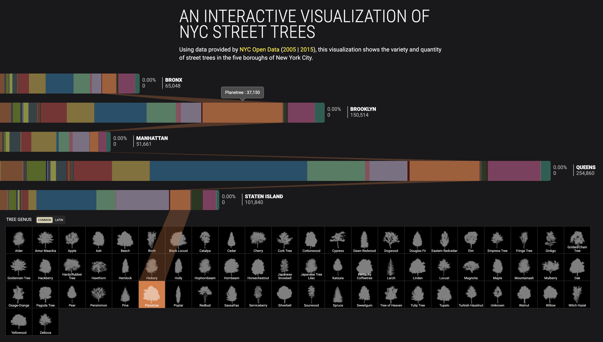
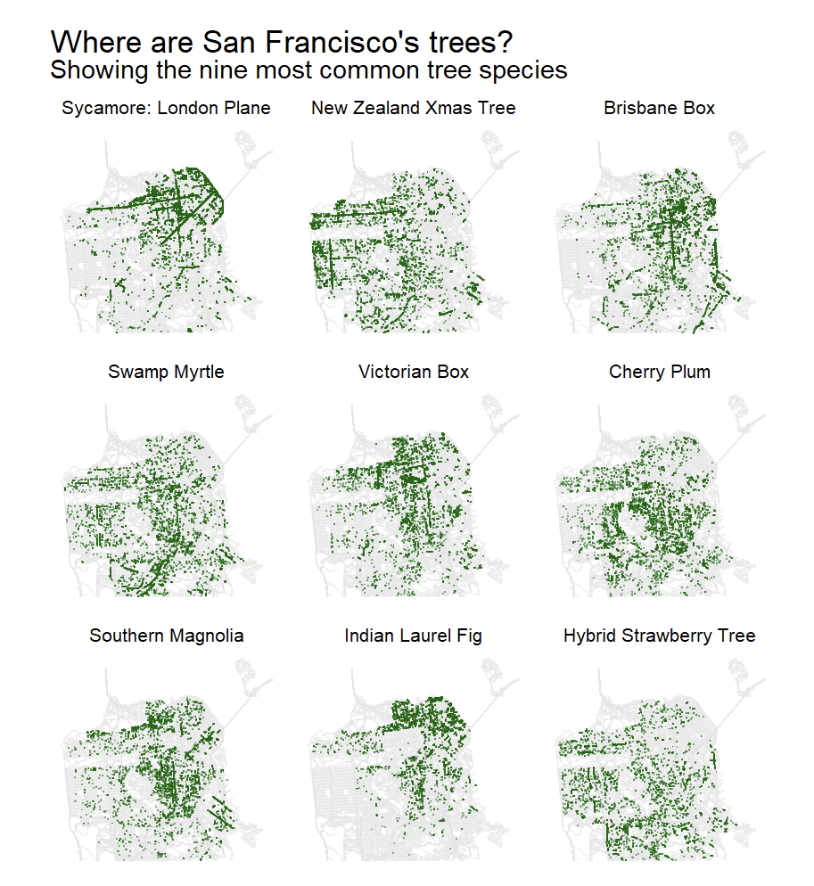
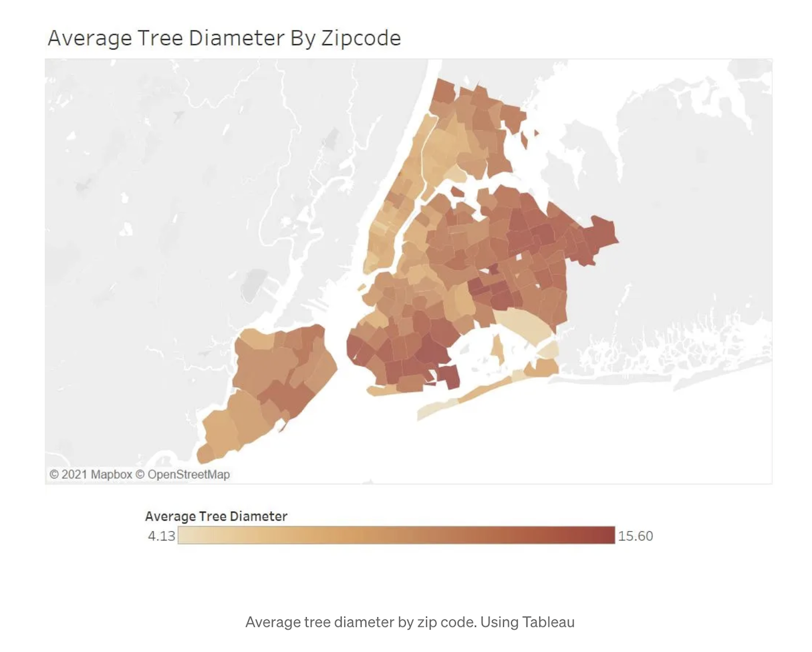
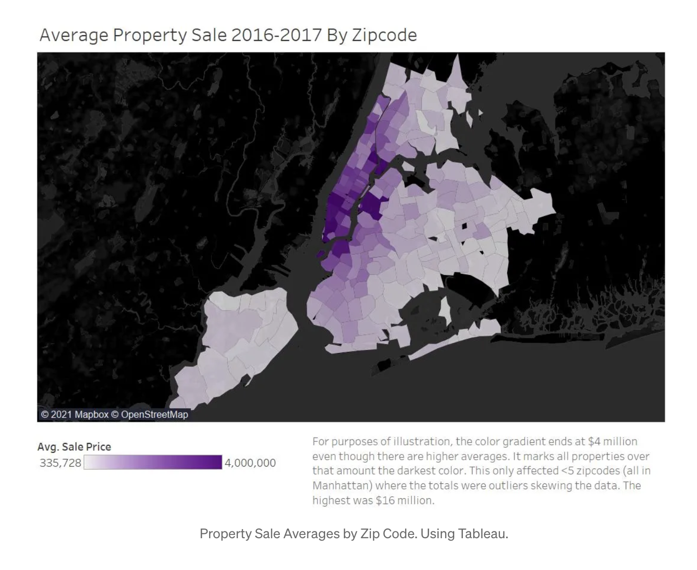
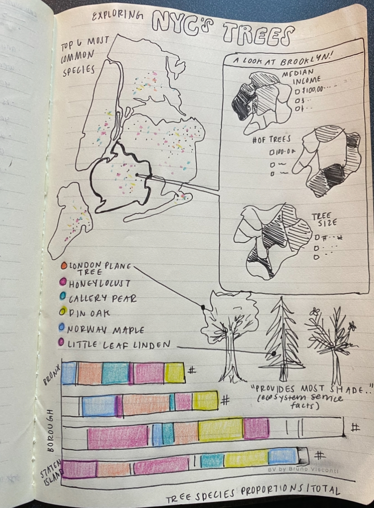

### Pre-planning

1.  Restate the questions you hope to answer with your inforgraphic. This should include one overarching question (think of this as driving the overall theme of your infographic) and at least three subquestions (each of which will be addressed by your infographic’s component visualizations). Have these questions changed at all since FPM #1? If yes, how so?

**Overarching question:** How are New York City's trees distributed?

**Subquestions:**

-   How are New York City's trees spatially distributed?

-   What is the species makeup/diversity within the different boroughs?

-   Are there correlations between trees that provide ecosystem services and socioeconomic variables?

2.  Explain which variables from your data set(s) you will use to answer the above questions, and how.

-   From the Tree Census data, I will use the latitude and longitude columns to place point data around the city, and filter by other columns such as borough or species common name to facet or reduce points if needed. I will also incorporate TIGER/Line Shapefiles to include background boundaries of the city. This will allow me to visualize the density of trees within each borough. 

-   From the Tree Census data, I will use the species common name and borough columns to find the most common species in each. This will give me variables to show the diversity of trees within each borough. 

-   I will join the Tree Census data with American Community Survey data from the same year, 2015, using the {tidycensus} package on the census tract column to analyze socioeconomic variables (median household income per tract) and number of trees or health of trees in each tract together.

I might also add information about the tree species I find to be the most common somewhere in my infographic, such as shade provision or pollen production to tie in the ecosystem services provided by these trees in different areas of NYC.

### Data visualization inspiration:

[Interactive visualization of NYC Street Trees](https://www.cloudred.com/labprojects/nyctrees/#about)

```{r}
#| eval: true
#| echo: false
#| fig-align: "center"
#| out-width: "100%"
#| fig-alt: "Interactive visualization of NYC Street Trees"

```

  I really like this visualization because it allows the viewer to pick either a tree or a proportion of a borough and see the how it connects to the other. I won't be able to incorporate interactivity in my infographic, but I found it useful to see the connection between the proportion of species in each borough and the tree itself. I think that I could incorporate a stacked bar chart of species similar to this one, and place tree silhouettes somewhere else in my infographic, especially of the most common trees. 

[Mapping San Francisco's Trees](https://www.alexcookson.com/post/mapping-san-francisco-trees/)

```{r}
#| eval: true
#| echo: false
#| fig-align: "center"
#| out-width: "100%"
#| fig-alt: "Mapping San Francisco's Trees"

```

  This visualization provided some inspiration for plotting the spatial distribution of my tree data. I really like the consistent coloring, lighter background of roads to provide geographic context, and the faceting by species. I think I could incorporate this faceting in my visualization and separation into top species, as it might be visually overwhelming/indistinguishable to plot every single tree point in each borough. 
  
[Average Tree Diameter by Zip Code](https://jrachelp.medium.com/nyc-trees-and-property-values-data-visualization-c94ca35da042)

```{r}
#| eval: true
#| echo: false
#| fig-align: "center"
#| out-width: "60%"
#| fig-alt: "Average Tree Diameter by Zip Code"

```
```{r}
#| eval: true
#| echo: false
#| fig-align: "center"
#| out-width: "60%"
#| fig-alt: "Average Property Sale by Zip Code"

```

These visualization uses the same Tree Census data and NYC Property Sales data, similar to how I am combining Tree Census data and US Census data. I thought that these maps showed an interesting combination of tree and socioeconomic variables, and that I could do this for number of trees by census tract and one for my variable of interest, median household income. 

### Data viz sketches!

```{r}
#| eval: true
#| echo: false
#| fig-align: "center"
#| out-width: "80%"
#| fig-alt: "Sketch of possible infographic graphs and layout"

```

### Code recreations 

#### Data loading and wrangling 
```{r}
#| message: FALSE
library(tidyverse)
library(here)
library(janitor)
library(sf)
library(showtext)
library(tidycensus)
library(readr)
library(ggspatial)

# Add fonts
font_add_google(name = "Libre Franklin", family = "franklin") # New York Times headers
showtext_auto()

# Create color palette 
 tree_palette <- c("London planetree" = "#39B185FF", "Honeylocust" = "#009392FF", "Callery pear" = "#9D9DCC", "Pin oak" = "#E9E29CFF", "Norway maple" = "#EEB479FF", "Littleleaf linden" = "#CF597EFF", "Cherry" = "#E88471FF", "Ginkgo" = "#9CCB86FF",  "Japanese zelkova" = "#97b293", "Red maple" = "#51344D", "Sweetgum" = "#e5c97f", "Sophora" = "#CAD49D", "Other" = "#B1C7B3FF", "Other large canopy species" = "#B1C7B3FF")
 
  #tree_palette <- c("London planetree" = "#39B185FF", "Honeylocust" = "#009392FF", "Callery pear" = "#d2c7e0", "Pin oak" = "#E9E29CFF", "Norway maple" = "#EEB479FF", "Littleleaf linden" = "#CF597EFF", "Cherry" = "#76a1b2", "Ginkgo" = "#50723C",  "Japanese zelkova" = "#97b293", "Red maple" = "#51344D", "Sweetgum" = "#e5c97f", "Sophora" = "#CAD49D", "Other" = "#B1C7B3FF")
```

```{r}
#| message: FALSE
#| warning: FALSE
#| results: hide
# Import ACS data 
acs_vars <- tidycensus::load_variables(year = 2015,
                                       dataset = "acs5")
# Import census tract income data
nyc_income <- get_acs(
  geography = "tract",
  variables = "B19013_001",
  state = "NY",
  county = c("061", "047", "081", "005", "085"),
  year = 2015,
  survey = "acs5",
  geometry = TRUE
) %>% 
  clean_names() %>% 
  mutate(
    census_tract = str_extract(name, "(?<=Census Tract )[\\d.]+"),
    borough = case_when(
      str_detect(name, "New York County") ~ "Manhattan",
      str_detect(name, "Kings County")    ~ "Brooklyn",
      str_detect(name, "Queens County")   ~ "Queens",
      str_detect(name, "Bronx County")    ~ "Bronx",
      str_detect(name, "Richmond County") ~ "Staten Island"
    )
  )

# Write to csv 
readr::write_csv(nyc_income, here::here("data", "nyc_income.csv"))
 
```

```{r}
#| message: FALSE

# Read in Tree Census data- full
trees <- read_csv(here("data", "2015_Street_Tree_Census_Data.csv")) %>% 
  clean_names() %>% 
  # Filter to living trees
  filter(status == "Alive") %>% 
  mutate(spc_common = str_to_sentence(spc_common))

# Read in Tree Census data- Brooklyn
brooklyn_trees <- read_csv(here("data", "Brooklyn_2015_Street_Tree_Census.csv")) %>% 
  clean_names()
```

```{r}
#| warning: FALSE
# Join Tree Census and ACS data
trees_census <- trees %>% 
  mutate(census_tract = as.character(census_tract)) %>% 
  left_join(nyc_income, by = c("census_tract" = "census_tract"))
```

#### Visualization 1: Full NYC Map- distribution of top 6 tree species

```{r}
# Find top tree species in NYC
top_trees <- trees %>% 
  count(spc_common, sort = TRUE) %>% 
  slice_head(n = 7)

# Filter data by these trees
trees_top <- trees %>% 
  filter(spc_common %in% c("London planetree", "Honeylocust", "Callery pear", "Pin oak", "Norway maple", "Littleleaf linden")) 

# Get NYC census tract boundaries for plotting
census_tracts <- read_sf(here("data", "tl_2015_36_tract", "tl_2015_36_tract.shp")) %>% 
  filter(COUNTYFP %in% c("061", "047", "081", "005", "085")) %>% 
  # Match CRS to tree data lat & long
  st_transform(4326)

```

```{r}
#| fig-width: 8
#| fig-height: 8
#| message: FALSE

# Create top trees in NYC plot
p1 <-  ggplot(trees_top) +
  #geom_sf(data = census_tracts, col = "grey80", fill = NA, alpha = 0.8) +
  annotation_map_tile(type = "cartolight", zoom = 11) +
  geom_point(
    aes(longitude, latitude, color = spc_common),
    shape = 16,
    size = 0.2,
    alpha = 0.5
  ) +
  coord_sf(crs = 4326) +
  labs(title = "Where are NYC's trees?",
       subtitle = "Top 6 most common tree species in New York City",
       caption = "Data Sources: NYC Open Data, US Census Bureau TIGER Shapefiles (2015)") +
  scale_color_manual(values = tree_palette) +
  guides(color = guide_legend(override.aes = list(size = 6))) +
  theme_void(base_size = 20) +
  theme(
        panel.spacing = unit(1.3, "lines"),
        strip.clip = "off",
        strip.text = element_text(family = "franklin"),
        plot.subtitle = element_text(family = "franklin", margin = margin(b = 12)),
        plot.caption = element_text(family = "franklin", size = rel(0.5), margin = margin(t = 5)),
        plot.title = element_text(family = "franklin", face = "bold", size = rel(1.7), margin = margin(b = 8)),
        plot.margin = margin(t = 4, r = 1, b = 10, l = 1),
           # move legend below plot ----
       legend.position = "bottom",
       legend.direction = "horizontal",
       legend.title = element_blank(),
       legend.key.width = unit(0.4, "cm"),
       legend.key.height = unit(0.25, "cm"),)

p1

ggsave(here("figures", "nyc_species_map.pdf"), width = 8, height = 10, dpi = 150, bg = "white")
```


#### Visualization 2: Stacked bar plot of shade providing species by borough


```{r}
#| message: FALSE
#| warning: FALSE
#| fig-width: 8
#| fig-height: 7

# Create list of large trees from NYC gov (https://www.nycgovparks.org/trees/street-tree-planting/species-list#:~:text=Table_title:%20Large%20Trees:%20Mature%20Height%20Greater%20Than,:%20Pin%20Oak%20%7C%20Form:%20Rounded%20%7C) 
large_trees <- c(
  "Ginkgo", "Sweetgum", "Dawn redwood", "Baldcypress",
  "Littleleaf linden", "Coffeetree", "Honeylocust",
  "Northern red oak", "Swamp white oak", "Shingle oak",
  "Pin oak", "Willow oak", "American linden",
  "Crimean linden", "Silver linden", "Japanese zelkova"
)

shade_plot <- trees_census %>%
  filter(!is.na(estimate)) %>%
  mutate(species_grp = case_when(
    spc_common %in% large_trees & spc_common %in% c("London planetree", "Honeylocust", "Callery pear",
                                                      "Pin oak", "Norway maple", "Littleleaf linden") ~ spc_common,
    spc_common %in% large_trees ~ "Other large canopy species",
    TRUE ~ "Other"
  )) %>%
  mutate(species_grp = fct_relevel(species_grp,
    "Honeylocust", "Pin oak", "Littleleaf linden", "Other large canopy")) %>% 
  group_by(borough.x, species_grp) %>%
  summarize(n = n()) %>%
  group_by(borough.x) %>%
  mutate(prop = n / sum(n)) %>%
  filter(species_grp != "Other")


 p2 <- ggplot(shade_plot, aes(x = prop, y = borough.x, fill = species_grp)) +
  geom_col() +
  scale_fill_manual(values = tree_palette) +
  coord_flip() +
  scale_x_continuous(labels = scales::label_percent()) +
  labs(x = "Proportion of All Trees",
       title = "Proportion of Shade-providing\nTrees by Borough",
       subtitle = "What proportion of each borough's trees are classified by NYC Parks\nas large trees with a mature height greater than 50 feet?",
       y = NULL, fill = NULL) +
  theme_minimal(base_size = 18) +
  theme(
    plot.title = element_text(family = "franklin", face = "bold", size = rel(1.5), margin = margin(b = 8)),
    plot.subtitle = element_text(family = "franklin", size = rel(0.9)),
    axis.text = element_text(size = rel(0.6), family = "franklin"),
    legend.text = element_text(size = rel(0.7), family = "franklin"),
    axis.title = element_text(size = rel(0.8), family = "franklin"),
    legend.position = "bottom",
    legend.direction = "horizontal"
  )
 p2
 
 ggsave(here("figures", "shade_barplot2.pdf"), width = 9, height = 11, dpi = 150)
```

#### Visualization 3: Box plot of species diversity by income

```{r}
#| warning: FALSE
#| message: FALSE
#| fig-width: 8
#| fig-height: 6

income_levels <- trees_census %>%
  filter(!is.na(estimate), census_tract != 109) %>% 
  group_by(census_tract, estimate) %>%
  summarize(n_species = n_distinct(spc_common)) %>%
  filter(n_species > 2) %>% 
  mutate(income_bin = cut(estimate,
                          breaks = c(0, 25000, 50000, 75000, 125000, Inf),
labels = c("<$25k", "$25-50k", "$50-75k", "$75-125k", "$125k+")))


p3 <-  ggplot(income_levels, aes(x = income_bin, y = n_species)) +
  #geom_jitter(alpha = 0.4, width = 0.2, color = "#89BA6F") +
  geom_violin(alpha = 0.8, outlier.shape = NA, fill = "#C1E1C1", color = "#89BA6F") +
  labs(x = "Median Household Income",
       y = "Unique Species in Census Tract",
       title = "Census Tract Species Diversity by Income",
       subtitle = "How does the number of unique tree species within a\ncensus tractdiffer based upon it's median household income?") +
  theme_minimal(base_size = 13) +
  theme(
    plot.title = element_text(family = "franklin", face = "bold", size = rel(1.4), margin = margin(b = 8)),
    plot.subtitle = element_text(family = "franklin", size = rel(1)),
    axis.text = element_text(size = rel(0.9), family = "franklin",  margin = margin(b = 8)),
    axis.title = element_text(size = rel(1.1), family = "franklin")
  )

p3

ggsave(here("figures", "income_boxplot.pdf"), width = 6, height = 8, dpi = 150)
```

#### Additional visualization attempts

```{r}
#| fig-width: 12
#| fig-height: 6
# Create annotations- will do in affinity!
#annotation1 <- glue::glue(
#  "53% | 125 unique species"
#)
species_count <- trees %>%
  mutate(species_grp = if_else(spc_common %in% c("London planetree", "Honeylocust", "Callery pear",
                                                   "Pin oak", "Norway maple", "Littleleaf linden"),
                                spc_common, "Other")) %>%
  group_by(borough, species_grp) %>%
  summarize(species_count = n()) %>%
  mutate(species_grp = fct_relevel(species_grp,
    "Littleleaf linden", "Norway maple", "Pin oak", "Callery pear", "Honeylocust", "London planetree", "Other"))

# Get information for annotations 
# Proportion of "Other" by borough
other_props <- species_count %>%
  group_by(borough) %>%
  mutate(prop = species_count / sum(species_count)) %>%
  filter(species_grp == "Other") %>%
  select(borough, prop)

# Number of unique "Other" species
n_other <- trees %>%
  filter(!spc_common %in% c("London planetree", "honeylocust", "Callery pear",
                             "pin oak", "Norway maple", "littleleaf linden")) %>%
  group_by(borough) %>% 
  summarize(unique_other = n_distinct(spc_common))

# Stacked bar plot
ggplot(species_count, aes(x = species_count, y = borough, fill = species_grp)) +
  geom_col(alpha = 0.8) +
  scale_fill_manual(values = tree_palette) +
  labs(title = "Biodiversity by Borough",
       subtitle = "The 'Other' category makes up a significant portion of each borough's total trees.",
       caption = "Data Source: NYC Open Data Tree Census (2015)",
       x = "Tree count",
       y = "Borough",
       fill = "Species") +
  # Flip legend
  guides(fill = guide_legend(reverse = TRUE)) +
  scale_x_continuous(expand = c(0, 0)) +
  theme_minimal() +
  theme(
    plot.title = element_text(family = "franklin", face = "bold", size = 20, margin = margin(b = 10)),
    plot.subtitle = element_text(family = "franklin", size = 16),
    plot.caption = element_text(family = "franklin", size = 6, hjust = 1),
    axis.title.y = element_blank(),
    axis.text = element_text(size = 11, family = "franklin"),
    axis.title = element_text(size = 14)
  )
```


```{r}
trees_census %>%
  filter(!is.na(estimate)) %>%
  mutate(species_grp = if_else(spc_common %in% large_trees, spc_common, "Other")) %>%
  group_by(borough.x, species_grp) %>%
  summarize(n = n()) %>%
  group_by(borough.x) %>%
  mutate(prop = n / sum(n)) %>%
  filter(species_grp != "Other") %>%
  ggplot(aes(x = prop, y = borough.x, fill = species_grp)) +
  coord_flip() +
  geom_col() +
  scale_x_continuous(labels = scales::label_percent()) +
  labs(x = "Proportion of Shade Trees", y = NULL, fill = NULL) +
  theme_minimal()
```


```{r}
# Get top 6 species per borough
top_per_borough <- trees %>%
  group_by(borough, spc_common) %>%
  summarize(n = n()) %>%
  group_by(borough) %>%
  mutate(prop = n / sum(n)) %>%
  slice_max(n, n = 6)

# Plot
ggplot(top_per_borough, aes(x = borough, y = prop, fill = spc_common)) +
  geom_col() +
  scale_fill_manual(values = tree_palette) +
  scale_y_continuous(labels = scales::label_percent()) +
  labs(title = "Top Tree Species by Borough",
       x = NULL, y = "Proportion", fill = "Species") +
  theme_minimal() +
  theme(
    plot.title = element_text(family = "franklin", face = "bold", size = 20, margin = margin(b = 10)),
    plot.subtitle = element_text(family = "franklin", size = 16),
    plot.caption = element_text(family = "franklin", size = 6, hjust = 1),
    axis.title.y = element_blank(),
    axis.text = element_text(size = 11, family = "franklin"),
    axis.title = element_text(size = 14)
  ) 
```


```{r}
#| message: FALSE
library(ggspatial)

trees %>%
  ggplot() +
  geom_sf(data = census_tracts, col = "grey80", fill = NA, alpha = 0.8) +
  annotation_map_tile(type = "cartolight", zoom = 11) +
  geom_hex(aes(longitude, latitude), bins = 60) +
  scale_fill_gradientn(colors = c("#ECFFDC", 	"#097969")) +
  coord_sf() +
  theme_minimal()
```


```{r}
trees_census %>%
  filter(borough.x == "Brooklyn", !is.na(estimate), !is.na(spc_common)) %>%
  mutate(
    income_bin = cut(estimate, 
breaks = c(0, 30000, 55000, 85000, 120000, 175000, Inf),
labels = c("<$30k", "$30-55k", "$55-85k", "$85-120k", "$120-175k", "$175k+")
  )) %>%
  group_by(income_bin, spc_common) %>%
  summarize(n = n()) %>%
  group_by(income_bin) %>%
  mutate(prop = n / sum(n)) %>%
  slice_max(prop, n = 6) %>%
  ggplot(aes(x = income_bin, y = prop, fill = spc_common)) +
  geom_col() +
  scale_y_continuous(labels = scales::label_percent()) +
  labs(x = "Median Household Income", y = "Proportion", fill = "Species", title = "Manhattan Species distributions by income bin") +
  theme_minimal() +
  theme(
    plot.title = element_text(family = "franklin", face = "bold", size = 20, margin = margin(b = 10)),
    plot.subtitle = element_text(family = "franklin", size = 16),
    plot.caption = element_text(family = "franklin", size = 6, hjust = 1),
    axis.title.y = element_blank(),
    axis.text = element_text(size = 11, family = "franklin"),
    axis.title = element_text(size = 14)
  )
```


### Visualization 3: Cholopleth maps of socioeconomic variables + tree stats

```{r}
# Plot median income
nyc_income %>%
  filter(borough == "Brooklyn", !is.na(estimate)) %>%
  ggplot(aes(fill = estimate)) +
  geom_sf(color = NA) +
  paletteer::scale_fill_paletteer_c("grDevices::Mint", direction = -1) +
  labs(title = "Median Household Income",
       subtitle = "By Census Tract in Brooklyn, New York (2015)",
       fill = "Median Income") +
  theme_void() +
  theme(
    plot.title = element_text(family = "franklin", face = "bold", size = 16),
    plot.subtitle = element_text(family = "franklin", size = 10),
    legend.title = element_text(family = "franklin", size = 10),
    legend.text = element_text(family = "franklin", size = 8),
    legend.key.size = unit(0.7, "cm")
    )
```

```{r}
# Plot number of trees
trees %>%
  filter(borough == "Bronx") %>%
  count(census_tract) %>%
  mutate(census_tract = as.character(census_tract)) %>%
  left_join(nyc_income, by = "census_tract") %>%
  filter(borough == "Bronx") %>%
  st_as_sf() %>%
  ggplot(aes(fill = n)) +
  geom_sf(color = NA) +
  paletteer::scale_fill_paletteer_c("harrypotter::slytherin") +
  labs(title = "Tree Count",
       subtitle = "By Census Tract in Brooklyn, New York (2015)",
       fill = "Tree Count") +
  theme_void() +
  theme(
    plot.title = element_text(family = "franklin", face = "bold", size = 16),
    plot.subtitle = element_text(family = "franklin", size = 10),
    legend.title = element_text(family = "franklin", size = 10),
    legend.text = element_text(family = "franklin", size = 8),
    legend.key.size = unit(0.7, "cm")
  )
```
```{r}
# Plot mean tree diameter
trees %>%
  filter(borough == "Queens") %>%
  group_by(census_tract) %>%
  summarize(mean_dbh = mean(tree_dbh, na.rm = TRUE)) %>%
  mutate(census_tract = as.character(census_tract)) %>%
  left_join(nyc_income, by = "census_tract") %>%
  filter(borough == "Queens") %>%
  st_as_sf() %>%
  ggplot(aes(fill = mean_dbh)) +
  geom_sf(color = NA) +
  paletteer::scale_fill_paletteer_c("harrypotter::slytherin") + 
  labs(title = "Mean Tree Diameter",
       subtitle = "By Census Tract in Brooklyn, New York (2015)",
       fill = "Mean DBH (inches)") +
  theme_void() +
    theme(
    plot.title = element_text(family = "franklin", face = "bold", size = 16),
    plot.subtitle = element_text(family = "franklin", size = 10),
    legend.title = element_text(family = "franklin", size = 10),
    legend.text = element_text(family = "franklin", size = 8),
    legend.key.size = unit(0.7, "cm")
  )
```

These three plots will be grouped together in affinity.

```{r}
#| fig-width: 8
#| fig-height: 8
#| message: FALSE

# BROOKLYN SUBSET EXAMPLE

# Find top tree species in Brooklyn
top_trees <- brooklyn_trees %>% 
  count(spc_common, sort = TRUE) %>% 
  slice_head(n = 6)

brooklyn_trees_top <- brooklyn_trees %>% 
  filter(spc_common %in% c("London planetree", "honeylocust", "pin oak", "Japanese zelkova", "Callery pear", "littleleaf linden"))

# Get Brooklyn census tract boundaries for plotting
br_census_tracts <- read_sf(here("data", "tl_2015_36_tract", "tl_2015_36_tract.shp")) %>% 
  filter(COUNTYFP == "047") %>% 
  st_transform(4326)

# Create top trees in Brooklyn plot
brooklyn_trees_top %>%
  ggplot() +
  geom_sf(data = br_census_tracts, col = "grey80", fill = NA, alpha = 0.7) +
  geom_point(
    aes(longitude, latitude),
    shape = ".",
    alpha = 0.5,
    col = "darkgreen"
  ) +
  coord_sf() +
  facet_wrap(~spc_common, strip.position = "bottom") +
  labs(title = "Where are Brooklyn's trees?",
       subtitle = "Top 6 most common tree species in Brooklyn, New York",
       caption = "Data Sources: NYC Open Data, US Census Bureau TIGER Shapefiles (2015)") +
  theme_void() +
  theme(
        panel.spacing = unit(1.3, "lines"),
        strip.clip = "off",
        strip.text = element_text(family = "franklin"),
        plot.subtitle = element_text(margin = margin(b = 15)),
        plot.caption = element_text(family = "franklin", size = 6, hjust = 1, margin = margin(t = 10)),
        plot.title = element_text(family = "franklin", face = "bold", size = 18, margin = margin(b = 10)),
        plot.margin = margin(t = 1, r = 1, b = 1, l = 1))
```

```{r}
trees_census %>%
  filter(!is.na(estimate), borough.x == "Brooklyn") %>%
  group_by(census_tract, estimate) %>%
  summarize(tree_count = n()) %>%
  ggplot(aes(x = estimate, y = tree_count)) +
  coord_cartesian(clip = "off") +
  stat_density_2d(colour = "green") +
  scale_x_continuous(expand = expansion(mult = 0.2)) +
  scale_y_continuous(expand = expansion(mult = 0.2)) +
  theme_minimal()
```


```{r}
trees_census %>%
  filter(!is.na(estimate), census_tract != 109) %>% 
  group_by(census_tract, estimate) %>%
  summarize(n_species = n_distinct(spc_common)) %>%
  filter(n_species > 2) %>% 
  mutate(income_bin = cut(estimate,
                          breaks = c(0, 25000, 50000, 75000, 125000, Inf),
labels = c("<$25k", "$25-50k", "$50-75k", "$75-125k", "$125k+"))) %>%
  ggplot(aes(x = income_bin, y = n_species)) +
  geom_jitter(alpha = 0.4, width = 0.2) +
  coord_flip() +
  geom_boxplot(alpha = 0.3, outlier.shape = NA) +
  labs(x = "Median Household Income", y = "Unique Species by Census Tract") +
  theme_minimal()
```

```{r}
library(ggridges)
trees_census %>%
  filter(!is.na(estimate), borough.x == "Brooklyn") %>%
  group_by(census_tract, estimate) %>%
  summarize(n_species = n_distinct(spc_common)) %>%
  mutate(income_bin = cut(estimate,
                          breaks = c(0, 25000, 40000, 55000, 75000, 110000, Inf),
                          labels = c("<$25k", "$25-40k", "$40-55k", "$55-75k", "$75-110k", "$110k+"))) %>%
  filter(!is.na(income_bin)) %>%
  ggplot(aes(x = n_species, y = income_bin, fill = income_bin)) +
  geom_density_ridges(alpha = 0.7) +
  labs(x = "Unique Species per Tract", y = "Median Household Income") +
  theme_minimal() +
  theme(legend.position = "none")
```


### Final questions
1. What are the key insights you want your infographic to communicate, and how will your design choices help highlight and support those messages?

I want to communicate how trees are distributed throughout New York City, in terms of location, species diversity, and distribution in relation to socioeconomic factors. My design choices highlight that about half of each borough is made up of just 6 species, and that there are areas with higher concentrations of these species. I also selected Brooklyn to look closer at for a chloropleth map of a socioeconomic variable and two tree-related variables, tree count and mean tree size. I think that these visualizations create a well-rounded look at NYC's trees with some interesting highlights. I also want to include some text and icons of these top tree species to describe what ecosystem services they provide to urban areas.

2. What challenges did you encounter or anticipate encountering as you continue to build / iterate on your visualizations in R? If you struggled with mocking up any of your three visualizations, describe those challenges here.

Deciding how to subset my data was difficult, as I have 600,000 data points of trees to work with and I want to make sure that my visualizations are not cluttered and convey a clear message. I also realized that some of the cenus tracts in Brooklyn appear to have no data in my chloropleth maps, and I am not sure that these are the most effective way to communicate my ideas/message generally. I also really liked the top 6 species in Brooklyn plot, but I am not sure if that ties in with my other visualizations.

3. What ggplot extension tools / packages do you need to use to build your visualizations? Are there any that we haven’t covered in class that you’ll be learning how to use for your visualizations?

I used the `sf` package and geom_sf for my census tract plotting. I also used {tidycensus} to get my census data and used TIGER/Line Shapefiles, which were both familiar from class. I am largely using theme edits for my plots, but will likely add a lot of annotations of trees, quotes, and lines that will be more new in affinity.

4. What feedback do you need from the instructional team and / or your peers to ensure that your intended message and key insights are clear?

I am not sure that my question is clear enough, or if there is a better set of visualizations that could communicate a main idea clearly based on the ones I have created so far. Also, in terms of color, I added a variety of colors but it could also be more on-theme and simple with just shades of green.